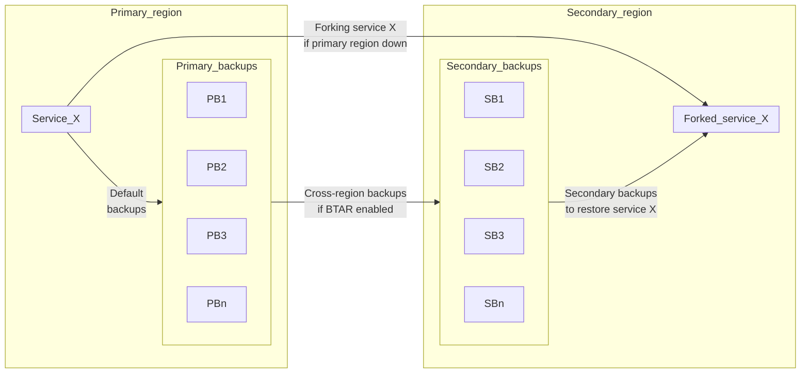

In addition to the primary service backup, you can have a secondary backup in an alternative location.

:::important
This feature is in [limited availability](/docs/platform/concepts/beta_services).
Contact your account team to enable it.
:::

## About BTAR

Backup to another region (BTAR) is a disaster recovery feature that allows backup
files to be copied from the service's primary backup region to an additional (secondary)
region. BTAR can bolster data resilience and helps improve data protection against
disasters in the primary backup region. When the primary region is down, BTAR allows
forking the service from an additional copy of the backup residing in a secondary region.

BTAR is supported for the following services:

- Aiven for PostgreSQL®
- Aiven for MySQL®
- Aiven for OpenSearch®

## How BTAR works

When you enable the backup to another region (BTAR) feature, an additional service backup
is created in the cloud region of your choice that is alternative to the primary backup
location.

Secondary backups are generated from primary backups, not from the service itself. For
this reason, your secondary backup becomes available only after the primary backup is
taken. There might be a data replication lag between the primary region and the secondary
region.

Restoring from a secondary backup, for example in case of an outage of the primary region,
can be done by creating a fork of the service in the region where the secondary backup is
located.

## Limitations

- BTAR is supported for Aiven for MySQL®, Aiven for PostgreSQL®, and Aiven for OpenSearch®.
- The cloud provider for your additional backup region must match the cloud provider for
  your service and the primary backup.
<!-- - To
  [restore your service from an additional backup](/docs/platform/howto/btar/manage-backup-to-another-region)
  using point-in-time recovery (PITR), set up the time to no later than the time of the
  latest backup.-->
- Secondary backup can only be restored in the region where it was stored.
- Secondary backup is generated only after a primary backup is complete, and there might
  be a data replication lag between the primary region and the secondary region.

## Related pages

- [Enable BTAR](/docs/platform/howto/btar/enable-backup-to-another-region)
- [Manage BTAR](/docs/platform/howto/btar/manage-backup-to-another-region)
- [Disable BTAR](/docs/platform/howto/btar/disable-backup-to-another-region)
