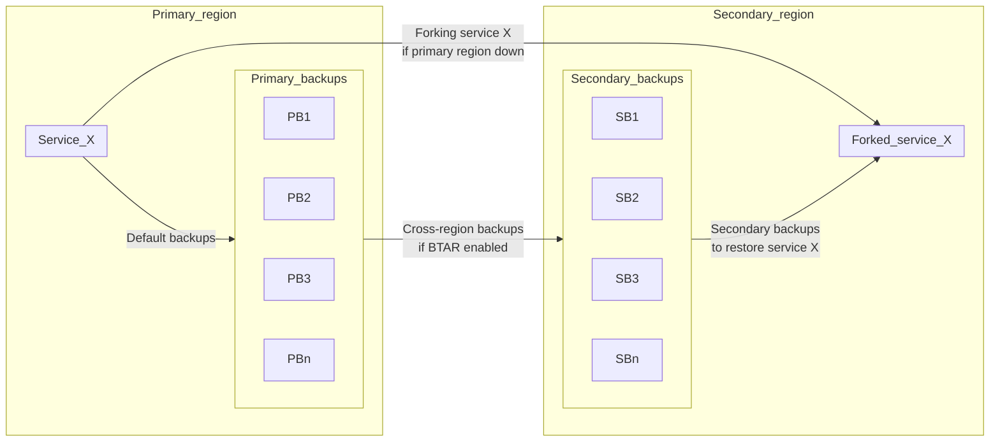

import RelatedPages from "@site/src/components/RelatedPages";
import Tabs from '@theme/Tabs';
import TabItem from '@theme/TabItem';

In addition to the primary service backup, you can have a secondary backup in an alternative location.

:::important
This feature is in [limited availability](/docs/platform/concepts/service-and-feature-releases#limited-availability-).
Contact your account team to enable it.
:::

Backup to another region (BTAR) is a disaster recovery feature that allows backup
files to be copied from the service's primary backup region to an additional (secondary)
region. BTAR can bolster data resilience and helps improve data protection against
disasters in the primary backup region. When the primary region is down, BTAR allows
forking the service from an additional copy of the backup residing in a secondary region.

## Limitations

- The cloud provider for your additional backup region must match the cloud provider for
your service and the primary backup.
- Secondary backup can only be restored in the region where it was stored.

### Supported services

BTAR is only supported for the following service types:

- Aiven for PostgreSQL®
- Aiven for MySQL®
- Aiven for OpenSearch®

### Service-specific limitations

<Tabs groupId="group1">
<TabItem value="sql-relational" label="PostgreSQL & MySQL" default>

- To
  [restore your service from an additional backup](/docs/platform/howto/btar/manage-backup-to-another-region)
  using point-in-time recovery (PITR), set up the time to no earlier than the time of
  taking the oldest replicated base backup.
- Secondary backup is generated only after a primary backup is complete, and there might
  be a data replication lag between the primary region and the secondary region.

</TabItem>
<TabItem value="non-sql-search-analytics" label="OpenSearch">

- The synchronization of snapshots between the regions works only for base snapshots created
after the BTAR activation.
- Point-in-time recovery (PITR) is not supported for
  [restoring your service from an additional backup](/docs/platform/howto/btar/manage-backup-to-another-region).
- Although a base snapshot in the primary region and its corresponding BTAR snapshot in
  the secondary region are generated at the same time, there might be some negligible data
  discrepancies between them.

## How BTAR works

When you enable the backup to another region (BTAR) feature, additional service backups
are created in the cloud region of your choice that is alternative to the primary backup
location.

Restoring from a secondary backup, for example in case of an outage of the primary region,
can be done by creating a fork of the service in the region where the secondary backup is
located.

<Tabs groupId="group1">
<TabItem value="sql-relational" label="PostgreSQL & MySQL" default>

Secondary backups are generated from primary backups, not from the service itself. For
this reason, your secondary backup becomes available only after the primary backup is
taken. There might be a data replication lag between the primary region and the secondary
region.

</TabItem>
<TabItem value="non-sql-search-analytics" label="OpenSearch">

An additional snapshot repository is created in the secondary region. In this repository,
BTAR snapshots are generated directly from the service. They are created and managed in
sync with base snapshots in the primary region. For example, when a base snapshot is
created in the primary region, its BTAR counterpart is created simultaneously in the
secondary region with an identical name.

</TabItem>
</Tabs>

</TabItem>
</Tabs>

<RelatedPages/>

- [Enable BTAR](/docs/platform/howto/btar/enable-backup-to-another-region)
- [Manage BTAR](/docs/platform/howto/btar/manage-backup-to-another-region)
- [Disable BTAR](/docs/platform/howto/btar/disable-backup-to-another-region)
