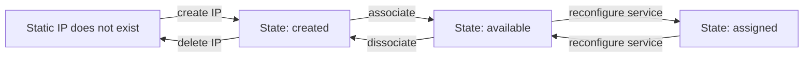

import StaticIp from "@site/static/includes/static-ip-cost-warning.md";

Aiven services are normally addressed by their hostname, but static IP addresses are also available for an additional charge.

Static IP address are useful with the following:

-   Firewall rules for specific IP addresses
-   Tools such as proxies that use IP addresses rather than hostnames

Static IP addresses on the Aiven platform are created in a specific cloud and belong to a
specific project. During their lifecycle, the IP addresses can be in a
number of states, and move between states by being created/deleted, by
being associated with a service, or when the service is reconfigured to
use the static IP addresses.



## Manage IP addresses

To create, delete, associate or dissociate IP addresses, use the `avn static-ip` CLI:

```bash
avn static-ip associate|create|delete|dissociate|list
```

To reconfigure a service, set its `static_ips` configuration value to `true` to
use static IP addresses, or `false` to stop using them.

:::note
- The `static_ip` configuration can only be enabled when enough static IP
  addresses have been created and associated with the service.

- <StaticIp/>
:::

By default, an Aiven service will use public IP addresses allocated from the
cloud provider's shared pool of addresses for the cloud region.

As a result, Aiven service IP addresses cannot be predicted. This is a good
approach for most use cases, but we do also offer static IP addresses,
should you need them. This allows you to configure a firewall rule for
your own services.

:::note
Each static IP address will incur a small charge.
:::

## Calculate the number of IP addresses needed {#platform_howto_setup_static_ip}

Work out how many IP addresses your service will need to guarantee that
the service has enough static IP addresses available to handle upgrades
and failures. The table below shows how to calculate the number of IP
addresses needed, depending on the size of your service plan.

| Plan size     | IP addresses needed        | Example                                                    |
| ------------- | -------------------------- | ---------------------------------------------------------- |
| up to 6 nodes | double the number of nodes | 3 node plan needs 6 static IP addresses (2 * 3 nodes)      |
| 6+ nodes      | number of nodes + 6        | 9 node plan needs 15 static IP addresses (9 nodes, plus 6) |

## Reserve static IP addresses

Create a static IP addresses using the
[Aiven CLI](/docs/tools/cli), repeat as many times as
needed to create enough IP addresses for your service. Specify the
name of the cloud that the IP address should be created in, to match the
service that will use it.

```
avn static-ip create --cloud azure-westeurope
```

The command returns some information about the newly created static IP
address.

```text
CLOUD_NAME        IP_ADDRESS  SERVICE_NAME  STATE     STATIC_IP_ADDRESS_ID
================  ==========  ============  ========  ====================
azure-westeurope  null        null          creating  ip359373e5e56
```

When the IP address has been provisioned, the state turns to `created`.
The list of static IP addresses in the current project is available
using the `static-ip list` command:

```
avn static-ip list
```

The output shows the state of each one, and its `ID`, which you will
need in the next step.

```text
CLOUD_NAME        IP_ADDRESS     SERVICE_NAME  STATE    STATIC_IP_ADDRESS_ID
================  =============  ============  =======  ====================
azure-westeurope  13.81.29.69    null          created  ip359373e5e56
azure-westeurope  13.93.221.175  null          created  ip358375b2765
```

Once the status shows as `created` IP address can be associated with a
service.

## Associate static IP addresses with a service

Using the name of the service, and the ID of the static IP address, you
can assign which service a static IP should be used by:

```
avn static-ip associate --service my-static-pg ip359373e5e56
avn static-ip associate --service my-static-pg ip358375b2765
```

When you have the required number of addresses available, you can enable
static IP addresses on your service.

## Configure a service to use static IP

Enable static IP addresses for the service by setting the `static_ips`
user configuration option:

```
avn service update -c static_ips=true my-static-pg
```

:::note
This leads to a rolling forward replacement of service nodes, similar to
applying a maintenance upgrade. The new nodes will use the static IP
addresses associated with the service
:::

Once the nodes have been replaced, they will be using the static IP
addresses that you associated with the service. You can check which ones
are in use by running the `avn static-ip list` command again. The
`available` state means that the IP is associated to the service, and
`assigned` means that it is in active use.

## Remove static IP addresses {#platform_howto_remove_static_ip}

:::note
To dissociate an IP from a service, the service must either have enough
IP addresses still available, or the `static_ips` configuration setting
for the service must be set to `false`.
:::

Static IP addresses are removed by first dissociating them from a
service, while they are not in use. This returns them back to the
`created` state to either be associated with another service, or
deleted.

```bash
avn static-ip dissociate ip358375b2765
```

To delete a static IP:

```bash
avn static-ip delete ip358375b2765
```

Neither the `dissociate` or `delete` commands return any information on
success.
