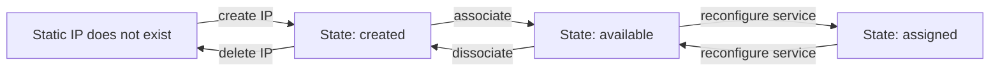

Aiven services are normally addressed by their hostname, but static IP addresses are also available for an additional charge.

Static IP address are useful with the following:

-   Firewall rules for specific IP addresses
-   Tools such as proxies that use IP addresses rather than hostnames

Static IP addresses on the Aiven platform are created in a specific cloud and belong to a
specific project. During their lifecycle, the IP addresses can be in a
number of states, and move between states by being created/deleted, by
being associated with a service, or when the service is reconfigured to
use the static IP addresses. This is summarised in the diagram.

To create, delete, associate or dissociate IP addresses, use the
[Aiven CLI](/docs/tools/cli) tool. To reconfigure a
service, set its `static_ips` configuration value to `true` to use
static IP addresses, or `false` to stop using them.

:::note
The `static_ip` configuration can only be enabled when enough static IP
addresses have been created and associated with the service.
:::

import StaticIp from "@site/static/includes/static-ip-cost-warning.md";

<StaticIp/>
