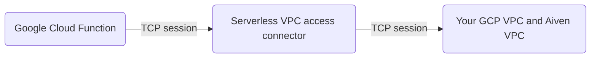

You can access Aiven service by creating a **Serverless VPC access connector** and **Google Cloud Function**.

By default, **Google Cloud Functions** can only access the Internet and is not
able to access your GCP VPC or Aiven VPC.

For **Google Cloud Functions** to access VPC, **Serverless VPC access
connector** is required. **Serverless VPC access connector** consists of two or
more Google-managed VM that forward requests (and perform NAT) from Cloud
Functions to your GCP VPC and Aiven VPC.



## Prerequisites

You have:

- Created a [VPC on the Aiven platform](/docs/platform/howto/manage-vpc-peering).
- Set up [VPC peering on GCP](/docs/platform/howto/manage-vpc-peering).

## Create a Serverless VPC access connector

1.  Open GCP console and go to **Navigation menu** > **Networking** > **VPC network** and select
    [Serverless VPC access](https://console.cloud.google.com/networking/connectors/list).

1.  Click **Create connector**:

    -   **Name**: The connector name of your choice.
    -   **Region**: The region where to create the Cloud Function.
    -   **Network**: Your GCP VPC, which is already peered to Aiven VPC already.
    -   **Subnet**: Select **custom IP range** and enter a **/28** private
        subnet that is not in use.

1.  If you have **allowed IP addresses** configured on your Aiven
    service, ensure the subnet of **serverless VPC access
    connector** is listed there

## Create a Cloud Function

1.  Open GCP console and under **Navigation menu**, **Serverless**
    section, select
    [Cloud Functions](https://console.cloud.google.com/functions/list).

1.  Click **create function**

    -   **Environment**: Your choice of environment. You can use the the default value (2nd
        gen).
    -   **Function name**: the name of your choice.
    -   **Region**: The region of the **serverless VPC access connector**.
    -   Click and expand the **runtime, build connections and security
        settings** section, select **Connections** tab, and select the
        **serverless VPC access connector** you have created.
    -   Click **Next**

1.  Select the runtime of your choice.

    :::warning
    Do not click **Test function**.
    :::

1. Click **Deploy**

1.  Wait for GCP to deploy the cloud function. Once deployed, use the
    **Source** tab to edit the function if needed.

    :::warning
    Do not click **Test function**.
    :::

1.  Click the **Testing** tab and test the command in Cloud Shell to ensure it can
    access VPC.

## Troubleshooting

If you cannot access your VPC or Aiven VPC from the Cloud Function,
consider using the following example for troubleshooting
purposes.

```python
# Cound Function 2nd gen, Python 3.11
import functions_framework
import socket

CLOUD_FUNCTION_KEY = 'gcf-aiven-test-CHANGE_ME_FOR_SECURITY_REASON'

@functions_framework.http
def hello_http(request):
  request_json = request.get_json(silent=True)

   if request_json and "cloud_function_key" in request_json and request_json["cloud_function_key"] == CLOUD_FUNCTION_KEY:
     result = ""
     try:
       host = request_json['host']
       port = request_json['port']
       timeout = request_json.get('timeout', 10)
       s = socket.socket(socket.AF_INET, socket.SOCK_STREAM)
       s.settimeout(timeout)
       s.connect((host, port))
       result = "OK"
     except Exception as e:
       result = repr(e)
       pass
     return 'Result: {}\n'.format(result)
   return "HTTP 401\n", 401
```

<!-- vale off -->
The request body contains:

- `CLOUD_FUNCTION_KEY` Change this to protect your Cloud Function endpoint,
  especially if it does not require authentication.
- `host`: FQDN or IP address if your Aiven service or VM in your GCP VPC.
- `port`: Destination TCP port number.
<!-- vale on -->

**Example:** In the **Testing** tab in your **Cloud Function**:

```json
{
  "cloud_function_key": "gcf-aiven-test-CHANGE_ME_FOR_SECURITY_REASON",
  "host": "fqdn-or-ip-to-your-aiven-service.a.aivencloud.com",
  "port": 12345
}
```

The request returns:

- `OK` if it can establish TCP 3-way handshake.
- `TimeoutError` if it cannot reach the specified port.

For assistance, contact Aiven support. When you do, share your your Cloud
Function endpoint and `CLOUD_FUNCTION_KEY`.
