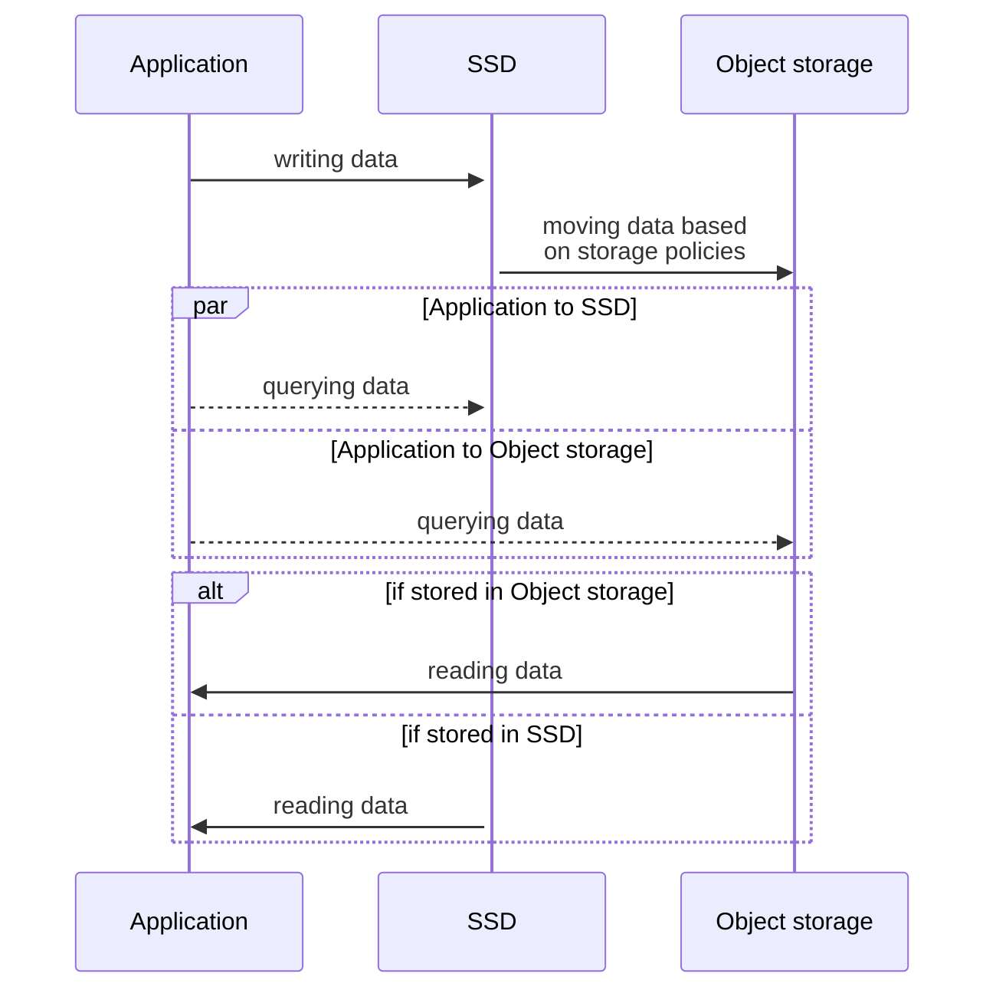

Discover the tiered storage capability in Aiven for ClickHouse®. Learn how it works and explore its use cases. Check out why you might need it and what benefits you get using it.

## Overview

The tiered storage feature introduces a method of organizing and storing
data in two tiers for improved efficiency and cost optimization. The
data is automatically moved to an appropriate tier based on your
database's local disk usage. On top of this default data allocation
mechanism, you can control the tier your data is stored in using custom
data retention periods.

The tiered storage in Aiven for ClickHouse consists of the following two
layers:

- SSD - the first tier: Fast storage device with limited capacity, better suited for fresh
  and frequently queried data, relatively costly to use
- Object storage - the second tier: Affordable storage device with unlimited capability, better suited
  for historical and more rarely queried data, relatively slower

## Why use it

By
[enabling](/docs/products/clickhouse/howto/enable-tiered-storage) and properly
[configuring](/docs/products/clickhouse/howto/configure-tiered-storage) the tiered storage feature in Aiven for ClickHouse, you can
use storage resources efficiently and, therefore, significantly reduce
storage costs of your Aiven for ClickHouse instance.

## How it works

After you
[enable](/docs/products/clickhouse/howto/enable-tiered-storage) the tiered storage feature, Aiven for ClickHouse by default
stores data on SSD until it reaches 80% of its capacity. After exceeding
this size-based threshold, data is stored in object storage.

Optionally, you can
[configure the time-based threshold](/docs/products/clickhouse/howto/configure-tiered-storage) for your storage. Based on the time-based threshold, the
data is moved from your SSD to object storage after a specified time
period.

:::note
Backups are taken for data that resides both on SSD and in object
storage.
:::

## Typical use case

In your Aiven for ClickHouse service, there is a significant amount of
data that is there for a while and is hardly ever accessed. It's stored
on SSD and, thus, high-priced. You decide to
[enable](/docs/products/clickhouse/howto/enable-tiered-storage) tiered storage for your service to make your data storage
more efficient and reduce the costs. For that purpose, you contact the
sales team at [sales@aiven.io](mailto:sales@aiven.io) to have it enabled on your project, and
you
[enable](/docs/products/clickhouse/howto/enable-tiered-storage) the feature on tables you want to optimize. You
[configure](/docs/products/clickhouse/howto/configure-tiered-storage) the time-based threshold to control how your data is stored
between the two layers.

## Limitations {#tiered-storage-limitations}

-   When
    [enabled](/docs/products/clickhouse/howto/enable-tiered-storage), the tiered storage feature cannot be deactivated.

    :::tip
    As a workaround, you can create a new table (without enabling tiered
    storage on it) and copy the data from the original table (with the
    tiered storage feature
    [enabled](/docs/products/clickhouse/howto/enable-tiered-storage)) to the new table. As soon as the data is copied to the
    new table, you can remove the original table.
    :::

-   With the tiered storage feature
    [enabled](/docs/products/clickhouse/howto/enable-tiered-storage), it's not possible to connect to an external existing
    object storage or cloud storage bucket.

## What's next

-   [Enable tiered storage in Aiven for ClickHouse](/docs/products/clickhouse/howto/enable-tiered-storage)
-   [Configure data retention thresholds for tiered storage](/docs/products/clickhouse/howto/configure-tiered-storage)

## Related pages

-   [Check data volume distribution between different disks](/docs/products/clickhouse/howto/check-data-tiered-storage)
-   [Transfer data between SSD and object storage](/docs/products/clickhouse/howto/transfer-data-tiered-storage)
