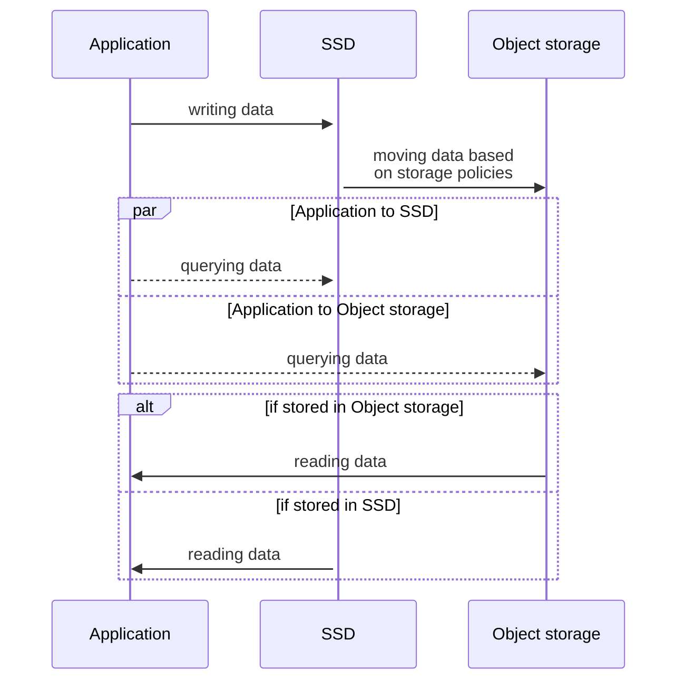

import ConsoleLabel from "@site/src/components/non-swizzled/ConsoleIcons";

The tiered storage feature introduces a method of organizing and storing data in two tiers for improved efficiency and cost optimization. The data is automatically moved to an appropriate tier based on your database's local disk usage.

On top of this default data allocation mechanism, you can control the tier your
data is stored in using custom data retention periods.

## Tiered storage architecture

The tiered storage in Aiven for ClickHouse® consists of the following two
layers:

- SSD - the first tier: Fast storage device with limited capacity, better suited for fresh
  and frequently queried data, relatively costly to use
- Object storage - the second tier: Affordable storage device with unlimited capability,
  better suited for historical and more rarely queried data, relatively slower

Aiven for ClickHouse's tiered storage supports
[local on-disk cache for remote files](/docs/products/clickhouse/howto/local-cache-tiered-storage),
which is enabled by default. You can
[disable the cache](/docs/products/clickhouse/howto/local-cache-tiered-storage#disable-the-cache)
or
[drop it](/docs/products/clickhouse/howto/local-cache-tiered-storage#free-up-space) to free
up the space it occupies.

## Supported cloud platforms

On the Aiven tenant (in non-[BYOC](/docs/platform/concepts/byoc) environments), Aiven for
ClickHouse tiered storage is supported on the following cloud platforms:

- Microsoft Azure
- Amazon Web Services (AWS)
- Google Cloud

## Why use it

By
[enabling](/docs/products/clickhouse/howto/enable-tiered-storage) and properly
[configuring](/docs/products/clickhouse/howto/configure-tiered-storage) the tiered storage
feature in Aiven for ClickHouse, you can
use storage resources efficiently and, therefore, significantly reduce
storage costs of your Aiven for ClickHouse instance.

## How it works

After you
[enable](/docs/products/clickhouse/howto/enable-tiered-storage) the tiered storage feature,
Aiven for ClickHouse by default
stores data on SSD until it reaches 80% of its capacity. After exceeding
this size-based threshold, data is stored in object storage.

Optionally, you can
[configure the time-based threshold](/docs/products/clickhouse/howto/configure-tiered-storage)
for your storage. Based on the time-based threshold, the
data is moved from your SSD to object storage after a specified time
period.

:::note
Backups are taken for data that resides both on SSD and in object
storage.
:::

## Typical use case

In your Aiven for ClickHouse service, there is a significant amount of
data that is there for a while and is rarely accessed. It's stored
on SSD and high-priced. You decide to
[enable](/docs/products/clickhouse/howto/enable-tiered-storage) tiered storage to make
your data storage more efficient and reduce the costs. For that purpose, you
[enable](/docs/products/clickhouse/howto/enable-tiered-storage) the feature on tables to
be optimized. You
[configure](/docs/products/clickhouse/howto/configure-tiered-storage) the time-based
threshold to control how your data is stored between the two layers.

## Limitations {#tiered-storage-limitations}

-   You can [enable](/docs/products/clickhouse/howto/enable-tiered-storage) tiered storage
    on the Aiven tenant (in non-[BYOC](/docs/platform/concepts/byoc) environments) if your
    Aiven for ClickHouse service is hosted on Azure, AWS, or GCP.
-   When
    [enabled](/docs/products/clickhouse/howto/enable-tiered-storage), the tiered storage
    feature cannot be deactivated.

    :::tip
    As a workaround, you can create a table (without enabling tiered
    storage on it) and copy the data from the original table (with the
    tiered storage feature
    [enabled](/docs/products/clickhouse/howto/enable-tiered-storage)) to the new table. As
    soon as the data is copied to the
    new table, you can remove the original table.
    :::

-   With the tiered storage feature
    [enabled](/docs/products/clickhouse/howto/enable-tiered-storage), it's not possible to
    connect to an external existing object storage or cloud storage bucket.

-   In the [Aiven Console](https://console.aiven.io/), there can be a mismatch in the
    displayed amount of data in object storage between what's showed in
    [<ConsoleLabel name="tieredstorage"/>](/docs/products/clickhouse/howto/list-tiered-storage#access-tiered-storage-details)
    and
    [Storage details](/docs/products/clickhouse/howto/list-tiered-storage#access-tiered-storage-details).

    This is because:

    - Information in
      [<ConsoleLabel name="tieredstorage"/>](/docs/products/clickhouse/howto/list-tiered-storage#access-tiered-storage-details)
      is updated every hour.

      :::tip
      To check if you successfully transferred data to object storage, display
      [Storage details](/docs/products/clickhouse/howto/list-tiered-storage#access-tiered-storage-details)
      of your table in the [Aiven Console](https://console.aiven.io/).
      :::

    - There can be unused data in object storage, for example before Aiven for ClickHouse
      performs a merge of parts or when a backup is performed before your table changes.
      Such unused data is removed once a day.

## What's next

-   [Enable tiered storage in Aiven for ClickHouse](/docs/products/clickhouse/howto/enable-tiered-storage)
-   [Configure data retention thresholds for tiered storage](/docs/products/clickhouse/howto/configure-tiered-storage)

## Related pages

-   [Check data volume distribution between different disks](/docs/products/clickhouse/howto/check-data-tiered-storage)
-   [Transfer data between SSD and object storage](/docs/products/clickhouse/howto/transfer-data-tiered-storage)
