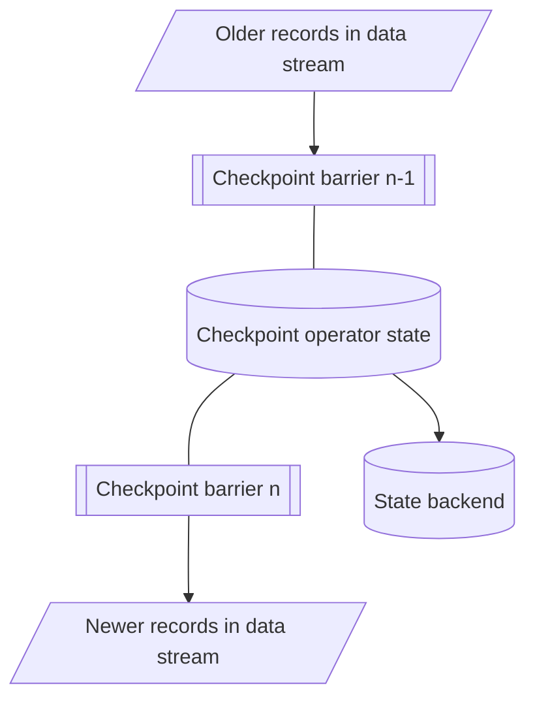

Checkpoints in Aiven for Apache Flink® are a key feature for ensuring resiliency and fault tolerance in stateful functions.

By periodically creating snapshots of the data stream and storing them, checkpoints
enable Apache Flink to recover the stream's state and position in the event of a failure,
ensuring that applications can continue to execute without interruption.

## Recover from failures

In the event of a failure, Aiven for Apache Flink uses these checkpoints
to restore the application's state and resume processing from the last
recorded reading position, allowing the application to continue as if
the failure had never occurred.

## Efficient data handling

Unlike traditional backups that create full data copies, checkpoints act more like
recovery logs. They periodically snapshot the data stream and store these snapshots,
making data handling more efficient.

## Visualize checkpoints

## Related pages

- [Apache Flink® documentation on
checkpoints](https://nightlies.apache.org/flink/flink-docs-release-1.19/docs/ops/state/checkpoints/)
