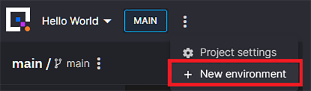
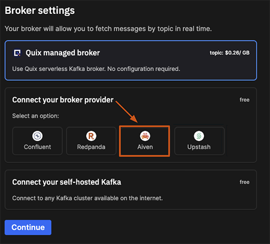
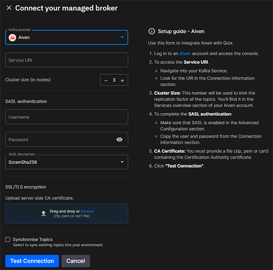
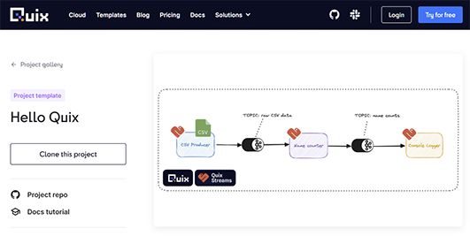
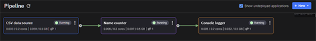

[Quix](https://quix.io?utm_source=aiven) is a complete platform for developing, deploying, and monitoring stream processing pipelines. You use the Quix Streams Python library to develop modular stream processing applications, and deploy them to containers managed in Quix with a single click. You can develop and manage applications on the command line or manage them in Quix Cloud and visualize them as a end-to-end pipeline.

This article provides you with the steps to connect the Aiven for Apache
Kafka® service with Quix. This integration enables you to consume data from Kafka, process it in real-time, and produce it back to Kafka via Quix Cloud.

## Prerequisites

To connect Aiven for Apache Kafka® and Quix, you need to have the
following setup:

-   A running Aiven for Apache Kafka® service. See
    [Getting started with Aiven for Apache Kafka](/docs/products/kafka/get-started) for more information.
-   A CA certificate file for your Kafka instance. See [Use SASL authentication with Aiven for Apache Kafka®](kafka-sasl-auth.md).
-   An account with Quix. If you don't yet have an account, you can [sign up for a free trial](https://portal.platform.quix.io/self-sign-up).

## Connect Aiven for Apache Kafka® to Quix

Follow the below steps to configure and connect Aiven for Apache Kafka®
with Klaw:

1. Log in to the **Quix Portal**.

2. Open an existing **Project** or create a project. For more details, see the **Create a test pipeline section** below.

3. Create an environment.
   * If you're editing an existing project, open the project settings and click **+ New environment**
   
   * Follow the setup wizard until you get to the broker settings.
3.  When you get to the broker settings, select **Aiven** as your broken provider

4.  Configure the required settings: 
* **Service URI**: Enter the Service URI for your Apache Kafka service. You can find the service URI in the Connection information page of your service in Aiven Console
* **Cluster Size**: This number will be used to limit the replication factor of the topics. You'll find it in the Services overview section of your Aiven account
* **User name**: Make sure that SASL is enabled in the Aiven Advanced Configuration section and copy the user name here.
* **Password**: Likewise, copy the password from the  Aiven Advanced Configuration section.
* **SASL Mechanism**: Use the same SASL mechanism as defined in the Aiven Advanced Configuration section.
* **CA Certificate**: Upload the CA file that you downloaded from the Aiven console.

## Create a test pipeline

To help you get started, the Quix platform includes several pipeline templates that you can deploy in a few clicks.

To test your Aiven for Apache Kafka® connection, you can use the ["Hello Quix" template](https://quix.io/templates/hello-quix) which is a simple three-step pipeline:

* Click [**Clone this project** ](https://portal.platform.quix.io/signup?projectName=Hello%20Quix&httpsUrl=https://github.com/quixio/template-hello-quix&branchName=tutorial).
* On the **Import Project** screen, select **Quix advanced configuration**  (this step ensures that you'll get the option to configure own broker settings).
* Follow the project creation wizard and configure your Aiven for Apache Kafka® connection details when prompted.
* Click **Sync your pipeline**

## Test the Setup

In the Quix portal, wait for the services to deploy and show up as "Running".

Check that the required topics ("_csv-data_" and "_counted-names_") show up in both Quix and Aiven. In Aiven, topics that originate from Quix will show up with the Quix workspace and project name as a prefix (e.g. "_quixdemo-helloquix-csv-data_").

## Related pages

[Quix documentation](https://quix.io/docs/get-started/welcome.html)

[Quix guide to creating projects](https://quix.io/blog/how-to-create-a-project-from-a-template#cloning-a-project-template-into-github)

[Quix Streams Python libary](https://github.com/quixio/quix-streams)
