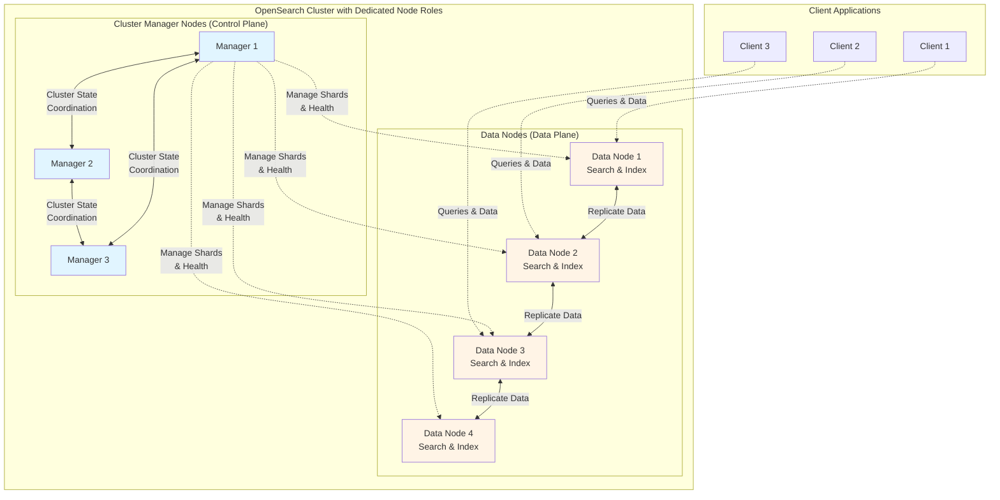

Aiven for OpenSearch® supports clusters with dedicated node roles, allowing you to assign specialized functions to different node groups for improved performance and scalability.

## What are dedicated node roles?

By default, OpenSearch nodes perform all roles: cluster management, data storage, and query processing. With dedicated node roles, you can separate these responsibilities across different node groups, each optimized for specific tasks.

This architecture separates the cluster's control plane from its data plane, ensuring that cluster management operations remain stable even during heavy query loads or data ingestion.

## Available node roles

### Cluster manager nodes

Cluster manager nodes handle cluster-wide operations such as:

- Managing cluster state and metadata
- Coordinating node membership
- Creating and deleting indices
- Tracking cluster health
- Allocating shards to nodes
- Orchestrating cluster-wide operations

These nodes run on smaller instances optimized for low-latency coordination tasks rather than data storage. Cluster manager nodes do not store data or handle search requests, allowing them to focus on maintaining cluster stability.

:::note
Cluster manager nodes are always configured in odd numbers (typically 3) to ensure proper quorum for cluster decisions and prevent split-brain scenarios.
:::

### Data nodes

Data nodes are responsible for:

- Storing and indexing data
- Executing search queries
- Performing data aggregations
- Processing ingest operations
- Handling client requests

Data nodes typically run on larger instances with more storage capacity and compute resources to handle data-intensive operations efficiently.

## Benefits of dedicated node roles

**Improved stability**: Separating cluster management from data operations prevents resource-intensive queries from affecting cluster coordination, reducing the risk of cluster instability.

**Better scalability**: You can scale data nodes independently from cluster manager nodes, adding capacity where needed without over-provisioning management resources.

**Optimized resource allocation**: Each node group can use hardware configurations tailored to its specific workload, improving cost efficiency.

**Enhanced performance**: Dedicated data nodes can focus entirely on query execution and data processing without the overhead of cluster management tasks.

## Cluster configuration

Dedicated node roles are defined at the service plan level. When you select a plan with dedicated roles:

- Cluster manager nodes are configured as a separate node group with their own instance type
- Data nodes form another group optimized for storage and compute
- The configuration is managed automatically by Aiven
- Cluster manager nodes are excluded from DNS routing for client connections
- Node roles are assigned during cluster creation and maintained throughout the cluster lifecycle

All standard service operations work with dedicated node roles, including service creation, major version upgrades, plan changes, service forking, and node replacement. The platform handles cluster manager node operations carefully to maintain cluster stability during updates.

## Node replacement and scaling

During maintenance or scaling operations:

- Data nodes can be scaled independently to adjust cluster capacity
- Cluster manager nodes are spawned and removed last during upgrades to maintain cluster coordination
- Node failures are handled automatically with role-aware replacement
- Disk space validation considers only data nodes, as cluster manager nodes do not store data

## Use cases

Dedicated node roles are particularly beneficial for:

**Large-scale deployments**: Clusters with high data volumes or query throughput benefit from isolating coordination overhead from data operations.

**Performance-critical applications**: Preventing resource contention between cluster management and query execution ensures consistent performance.

**Complex cluster topologies**: Larger clusters with many nodes see stability improvements when cluster management runs on dedicated hardware.

## Availability

Dedicated node roles are available for Aiven for OpenSearch® version 2 and later. The feature is included in select service plans designed for production workloads requiring enhanced performance and reliability.

:::tip
Contact Aiven support to learn which service plans include dedicated node roles and to get recommendations for your specific workload requirements.
:::

## Related pages

- [High availability in Aiven for OpenSearch®](/docs/products/opensearch/concepts/high-availability-for-opensearch)
- [Shards and replicas](/docs/products/opensearch/concepts/shards-number)
- [Service plans](/docs/platform/concepts/service-pricing)
