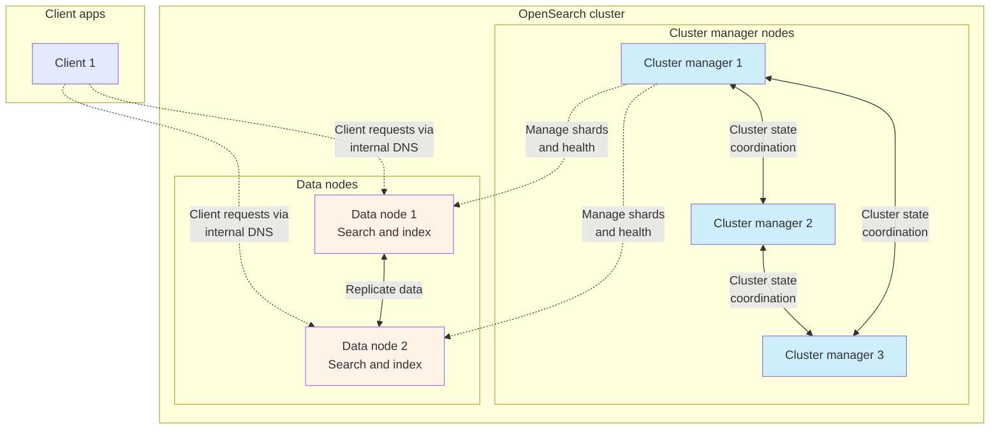

import RelatedPages from "@site/src/components/RelatedPages";
import LimitedBadge from "@site/src/components/Badges/LimitedBadge";

Aiven for OpenSearch® supports clusters with dedicated node roles, allowing you to assign specialized functions to different node groups for improved performance and scalability.

The dedicated node roles feature is in
[limited availability](/docs/platform/concepts/service-and-feature-releases#limited-availability-)
for Aiven for OpenSearch® version 2.19 and later. It's available in specific service plans
for production workloads that require enhanced performance and reliability.

:::tip
[Contact Aiven](https://aiven.io/contact) to request access, learn which service plans include
dedicated node roles, and get recommendations for your workload.
:::

## Benefits and use cases

The dedicated node roles feature helps achieve the following:

- **Improved stability**: Separating cluster management from data operations prevents
  resource-intensive queries from affecting cluster coordination, reducing the risk of
  cluster instability.
- **Better scalability**: You can scale data nodes independently from cluster manager
  nodes, adding capacity where needed without over-provisioning management resources.
- **Optimized resource allocation**: Each node group can use hardware configurations
  tailored to its specific workload, improving cost efficiency.
- **Enhanced performance**: Dedicated data nodes can focus entirely on query execution and
  data processing without the overhead of cluster management tasks.

The dedicated node roles feature is particularly beneficial for:

- **Large-scale deployments**: Clusters with high data volumes or query throughput benefit
  from isolating coordination overhead from data operations.
- **Performance-critical applications**: Preventing resource contention between cluster
  management and query execution ensures consistent performance.
- **Complex cluster topologies**: Larger clusters with many nodes see stability
  improvements when cluster management runs on dedicated hardware.

## About dedicated node roles

By default, OpenSearch nodes perform all roles: cluster management, data storage, and
query processing. With dedicated node roles, you can separate these responsibilities
across different node groups, each optimized for specific tasks.

This architecture separates the cluster control plane from the data plane.
It keeps cluster management operations stable during heavy query loads or data ingestion.

### Available node roles

#### Cluster manager nodes

Cluster manager nodes handle cluster-wide operations such as:

- Managing cluster state and metadata
- Coordinating node membership
- Creating and deleting indices
- Tracking cluster health
- Allocating shards to nodes
- Orchestrating cluster-wide operations

These nodes run on smaller instances optimized for low-latency coordination tasks rather
than data storage. Cluster manager nodes do not store data or handle search requests,
allowing them to focus on maintaining cluster stability.

:::note
Configure cluster manager nodes in odd numbers to ensure quorum for cluster decisions and
prevent split-brain scenarios.
:::

#### Data nodes

Data nodes are responsible for:

- Storing and indexing data
- Executing search queries
- Performing data aggregations
- Running ingest pipelines
- Handling client requests
- Coordinating distributed requests across the cluster
- Providing internal DNS routing for cluster traffic

In dedicated-role plans, each data node includes the data, ingest, coordinator, and
internal DNS roles. Data nodes typically run on larger instances with more storage and
compute resources for data-intensive operations.

### Cluster configuration

Dedicated node roles are defined at the service plan level. When you select a plan with
dedicated roles:

- Cluster manager nodes are configured as a separate node group with their own instance type.
- Cluster manager nodes are automatically distributed across different availability zones.
- Data nodes form another group optimized for storage and compute.
- The configuration is managed automatically by Aiven.
- Cluster manager nodes are excluded from DNS routing for client connections.
- Node roles are assigned during cluster creation and maintained throughout the cluster
  lifecycle.
- OpenSearch Dashboards is served on every node.
- Dedicated dashboard nodes are not included.

All standard service operations work with dedicated node roles, including service creation,
major version upgrades, plan changes, service forking, and node replacement. The platform
handles cluster manager node operations carefully to maintain cluster stability during
updates.

### Node replacement and scaling

During maintenance or scaling operations:

- To increase data capacity, move to a dedicated-role plan with more or larger data nodes
  while keeping the cluster manager layout unchanged.
- Cluster manager nodes are replaced last during maintenance updates, including version
  upgrades, to maintain cluster coordination.
- Node failures are handled automatically with role-aware replacement.
- Disk space validation and additional disk capacity apply only to data nodes, as cluster
  manager nodes do not store data. This makes adding disk space more cost-efficient
  compared to scaling disk across all nodes.

## Manage dedicated node roles

The dedicated node roles feature is plan-based.

### Prerequisites

- This is a <LimitedBadge/> feature. [Contact Aiven](https://aiven.io/contact) to enable it.
- [Upgrade Aiven for OpenSearch®](/docs/products/opensearch/howto/os-version-upgrade) to
  2.19 or later if your service runs an older version.

### Start using dedicated node roles

Create an Aiven for OpenSearch® service and choose a plan that includes
dedicated node roles. For steps, see
[Get started with Aiven for OpenSearch®](/docs/products/opensearch/get-started#create-an-aiven-for-opensearch-service).

### Configure dedicated node roles

To move to another dedicated-role layout, change the service plan to a
different eligible plan. For steps, see
[Change a service plan](/docs/platform/howto/scale-services).

### Disable dedicated node roles

Change the service plan to a plan without dedicated node roles. This
returns the service to a standard node layout where nodes share roles.
For steps, see [Change a service plan](/docs/platform/howto/scale-services).

<RelatedPages/>

- [High availability in Aiven for OpenSearch®](/docs/products/opensearch/concepts/high-availability-for-opensearch)
- [Shards and replicas](/docs/products/opensearch/concepts/shards-number)
- [Service plans](/docs/platform/concepts/service-pricing)
