Aiven for PostgreSQL customers with Business and Premium plans utilize standby nodes for HA failover. Customers frequently direct read queries to these standby nodes as an alternative to a dedicated read-replica to optimize their costs. However, if a standby node fails, the corresponding replica connection URI becomes unreachable. The service remains in this state until a new replica is automatically provisioned and restored from a backup, a process that can lead to significant downtime for applications that rely on the replica.

In order to solve this problem, this feature provides a mechanism to automatically and temporarily redirect read-only traffic from an unavailable secondary (read replica) node to the healthy primary node.

This feature addresses the problem by providing a mechanism to **automatically and temporarily redirect read-only traffic from an unavailable standby node to the healthy primary node**.

The diagram below illustrates the **complete HA Replica DNS lifecycle**, including feature enablement, failover, recovery, and disablement:

```mermaid
sequenceDiagram

autonumber

participant  Customer

participant  Acorn

participant  DB  as 🗄️ Aiven  DB

participant  Executor  as ⚙️ Executor

participant  Primary  as 🟢 Primary  Node

participant  Standby1  as 🟡 Standby  Node 1

participant  Standby2  as 🟡 Standby  Node 2

participant  DNSProvider  as 🌐 DNS  Provider



%% --- Phase 1: Feature Activation ---

rect  rgba(230,245,255,0.8)

Note  over  Customer,DB: 🟦 Customer  enables  HA  Replica  DNS

Customer->>Acorn: Enable  HA  Replica  DNS

Acorn->>DB: service_update(enable_ha_replica_dns = true)

DB-->>DB: Insert  ha_replica  DNS  record

DB-->>Executor: Schedule  build_dns_records  task

Executor-->>DNSProvider: Build  ha_replica  DNS → replica

Executor-->>Primary: Send  enable_ha_replica_dns  value

Note  over  Primary: Starts  monitoring  standby  health

Customer-->>Acorn: Request  service  info

Acorn-->>Customer: Return  ha_replica.avns.net  URI

end



%% --- Phase 2: Failover Trigger ---

rect  rgba(255,245,230,0.8)

Note  over  Primary,Standby2: 🩺 Primary  monitors  standbys

Primary->>Standby1: SELECT 1;

Standby1--x  Primary: Timeout ❌

Primary->>Standby2: SELECT 1;

Standby2--x  Primary: Timeout ❌

Note  over  Primary: All  standbys  unavailable > HA_REPLICA_FAILOVER_UNAVAILABLE_TIMEOUT

Primary-->>DB: Update  ha_replica_dns_target = "primary"

DB-->>Executor: Schedule  build_dns_records  task

Executor-->>DNSProvider: Update  ha_replica  DNS → primary

Note  over  DNSProvider: ha_replica.avns.net  now  points  to  primary

end



%% --- Phase 3: Standby Recovery ---

rect  rgba(240,255,240,0.8)

Note  over  Primary,Standby2: 🟢 Standbys  are  healthy  again

Primary->>Standby1: SELECT 1 OK ✅

Primary->>Standby2: SELECT 1 OK ✅

Primary-->>DB: Update  ha_replica_dns_target = "replica"

DB-->>Executor: Schedule  build_dns_records  task

Executor-->>DNSProvider: Update  ha_replica  DNS → replicas

Note  over  DNSProvider: ha_replica.avns.net  now  points  to  standby  nodes

Note  over  Primary: Normal  monitoring  continues, clients  route  read-only  traffic  to  replicas

end



%% --- Phase 4: Feature Disable ---

rect  rgba(255,230,230,0.8)

Note  over  Customer,DB: 🔴 Customer  disables  HA  Replica  DNS

Customer->>Acorn: Disable  HA  Replica  DNS

Acorn->>DB: service_update(enable_ha_replica_dns = false)

DB-->>Executor: Schedule  build_dns_records  task

Executor-->>DNSProvider: Suspend  ha_replica  DNS  (no target)

Note  over  Primary: 🛑 Primary  stops  monitoring  standby  health

Note  over  Customer: HA  Replica  URI  no  longer  available, read-only  traffic  uses  standard  replicas

end
```

## 1. Enabling the HA Replica DNS

By default, the **HA Replica DNS** feature is disabled for all services. Customers must explicitly enable it via the service’s user configuration (`enable_ha_replica_dns = true`).

When enabled, **Aiven DB** creates new **CNAME DNS records** for the service under the `ha_replica` usage. Based on the value of `ha_replica_dns_target` in the service state, the records will point to the corresponding URI. If the key has no value, the DNS defaults to `replica`.

After creating the DNS records, **Aiven DB** schedules a `build_dns_records` work item. Executor later processes the item, calling the DNS Provider to add the record. At this point, the DNS is available.

Once the feature is enabled, the primary node starts monitoring standby health. The primary will report if the new DNS needs to be rebuilt via `ha_replica_dns_target`. Meanwhile, the customer can see the new HA Replica connection URI when requesting the service information.

---

### Enabling HA Replica DNS Flow

The diagram below illustrates the **initial flow** when the HA Replica DNS feature is enabled:

## 2. Failover

As mentioned earlier, the primary node continuously monitors the standby nodes to ensure they are available for read operations. If it detects that **all standby nodes are unreachable** for longer than `ha_replica_failover_unavailable_timeout` (default 30 seconds), it updates `ha_replica_dns_target` to `'primary'`.

Once this change is reflected in the service state, **Aiven DB** recognizes that the HA Replica DNS records must be updated to point to the primary URI instead of the standbys. It schedules a `build_dns_records` work item, which **Executor** later processes. When processing the work item, Executor communicates with the DNS Provider to rebuild the records, ensuring that the HA Replica DNS now resolves to the primary node.

During this period, new client connections that rely on the HA Replica DNS will connect to the primary, maintaining availability even though the standbys are down. Existing connections to the replicas may fail, but the system ensures that all new read-only traffic is routed to a healthy node.

### Failover HA Replica DNS Flow

The diagram below illustrates the **failover flow** when all standby nodes become unavailable:

```mermaid
sequenceDiagram

autonumber

participant  Primary  as 🟢 Primary  Node

participant  Standby1  as 🟡 Standby  Node 1

participant  Standby2  as 🟡 Standby  Node 2

participant  Database  as 🗄️ Aiven  DB

participant  Executor  as ⚙️ Executor

participant  DNSProvider  as 🌐 DNS  Provider



%% --- PHASE 1: HEALTH CHECK ---

rect  rgb(235, 245, 255)

Note  over  Primary,Standby2: 🩺 **Phase 1 — Standby  Health  Monitoring**

Primary->>Standby1: SELECT 1;

Standby1--x  Primary: Connection  timeout ❌

Primary->>Standby2: SELECT 1;

Standby2--x  Primary: Connection  timeout ❌

Note  over  Primary: All  standbys  unreachable  for<br>HA_REPLICA_FAILOVER_UNAVAILABLE_TIMEOUT

end



%% --- PHASE 2: FAILOVER TRIGGER ---

rect  rgb(255, 245, 230)

Note  over  Primary,Database: 🚨 **Phase 2 — Failover  Trigger**

Primary-->>Database: Update  service_state["ha_replica_dns_target"] = "primary"

Database-->>Executor: Schedule  build_dns_records  work_item

end



%% --- PHASE 3: DNS REBUILD ---

rect  rgb(240, 255, 240)

Note  over  Executor,DNSProvider: 🔄 **Phase 3 — DNS  Rebuild**

Executor-->>DNSProvider: Rebuild  DNS  records  (ha_replica → primary)

Note  over  DNSProvider: ha_replica.avns.net  now  resolves  to<br>the  primary  node's  IP

end



%% --- PHASE 4: CONTINUATION ---

rect  rgb(245, 245, 245)

Note  over  Primary,Database: 🕒 **Phase 4 — Monitoring  Continues**

Note  over  Primary: Standby  checks  keep  running

end
```

## 3. Recovery

Once the standby nodes recover and are reachable again, the HA Replica DNS can be reverted to point back to the replicas. The primary node continuously monitors the standby nodes’ health, and when it detects that all standbys are healthy, it updates `ha_replica_dns_target` to `'replica'`.

This triggers the same process as before: **Aiven DB** schedules a `build_dns_records` work item, and Executor updates the HA Replica DNS. As a result, the HA Replica URI now resolves to the standby nodes again, allowing new read-only connections to be routed to the replicas. The primary node continues monitoring all standbys to ensure the HA Replica DNS always points to healthy nodes.

### Recovery HA Replica DNS Flow

The diagram below illustrates the **recovery flow** when all standby nodes become available:

```mermaid
sequenceDiagram
    autonumber
    participant Primary as 🟢 Primary Node
    participant Standby1 as 🟡 Standby Node 1
    participant Standby2 as 🟡 Standby Node 2
    participant Database as 🗄️ Aiven DB
    participant Executor as ⚙️ Executor
    participant DNSProvider as 🌐 DNS Provider

    %% --- Phase 1: Health Monitoring ---
    rect rgba(235,245,255,0.8)
        Note over Primary,Standby2: 🩺 Primary continues periodic standby health checks
        Primary->>Standby1: SELECT 1;
        Standby1-->>Primary: OK ✅
        Primary->>Standby2: SELECT 1;
        Standby2-->>Primary: OK ✅
        Note over Primary: All standbys are now healthy
    end

    %% --- Phase 2: Restore HA Replica DNS Target ---
    rect rgba(255,245,230,0.8)
        Note over Primary,Database: 🔄 Primary updates ha_replica_dns_target to 'replica'
        Primary-->>Database: Update ha_replica_dns_target = "replica"
        Database-->>Executor: Schedule build_dns_records work item
    end

    %% --- Phase 3: DNS Rebuild ---
    rect rgba(240,255,240,0.8)
        Note over Executor,DNSProvider: ⚙️ Executor rebuilds HA Replica DNS
        Executor-->>DNSProvider: Update ha_replica DNS to point back to replicas
        Note over DNSProvider: ha_replica.avns.net now resolves to standby nodes
    end

    %% --- Phase 4: Normal Operation ---
    rect rgba(245,245,245,0.8)
        Note over Primary,Database: 🕒 Monitoring continues as normal
        Note over Primary: Clients now route read-only traffic to healthy replicas
    end

```

## 4. Disabling the HA Replica DNS

When the HA Replica DNS feature is disabled for a service, the flow mirrors the enablement process with a few key differences. **Aiven DB** updates the service state to reflect that `enable_ha_replica_dns` is now `false`. The existing HA Replica DNS records are **suspended**, meaning they no longer point to any node.

At the same time, the primary node stops monitoring the standby nodes for HA Replica failover. From this point onward, the HA Replica URI is no longer available to clients, and read-only traffic must rely on the standard replica URIs.

---

### Disabling HA Replica DNS Flow

```mermaid
sequenceDiagram

autonumber

participant  Customer

participant  Acorn

participant  DB  as 🗄️ Aiven  DB

participant  Executor  as ⚙️ Executor

participant  Primary  as 🟢 Primary  Node

participant  DNSProvider  as 🌐 DNS  Provider



%% --- Phase 1: Disable Request ---

rect  rgba(255,230,230,0.8)

Note  over  Customer,DB: 🔴 Customer  disables  HA  Replica  DNS

Customer->>Acorn: Disable  HA  Replica  DNS

Acorn->>DB: service_update(enable_ha_replica_dns = false)

end



%% --- Phase 2: Suspend DNS ---

rect  rgba(240,240,240,0.8)

Note  over  DB,Executor: ⏸️ Suspend  HA  Replica  DNS  records

DB-->>Executor: Schedule  build_dns_records  task

Executor-->>DNSProvider: Update  ha_replica  DNS → no  target

Note  over  DNSProvider: ha_replica.avns.net  temporarily  resolves  to  nothing

end



%% --- Phase 3: Stop Monitoring ---

rect  rgba(245,245,245,0.8)

Note  over  Primary: 🛑 Primary  stops  monitoring  standby  health

Note  over  Customer: HA  Replica  URI  is  no  longer  available.

end
```

